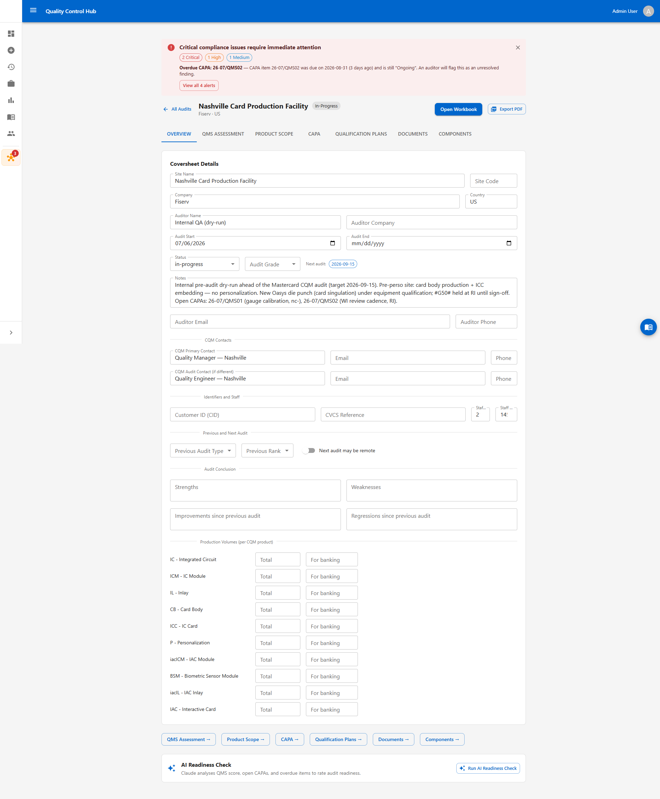
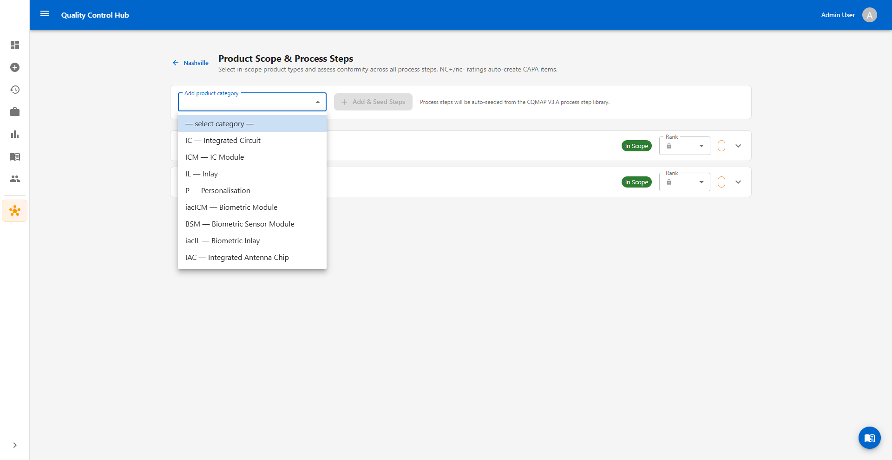
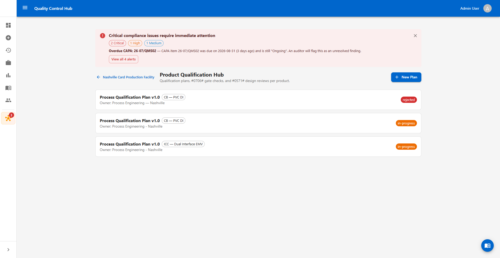
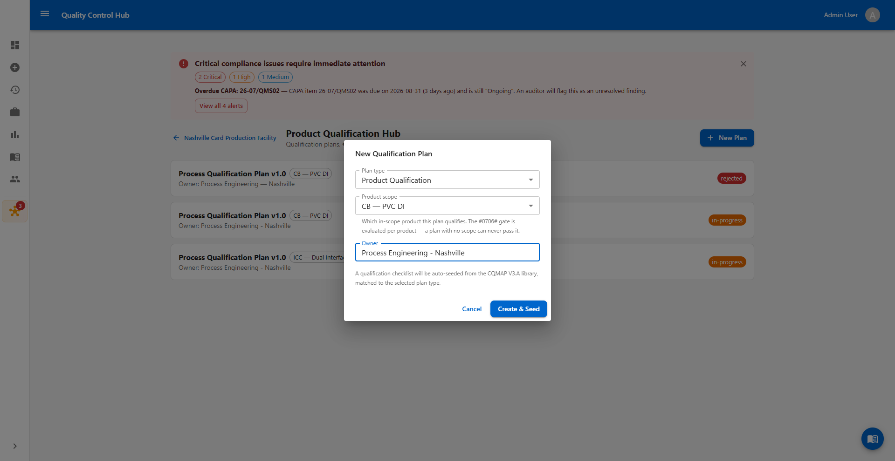
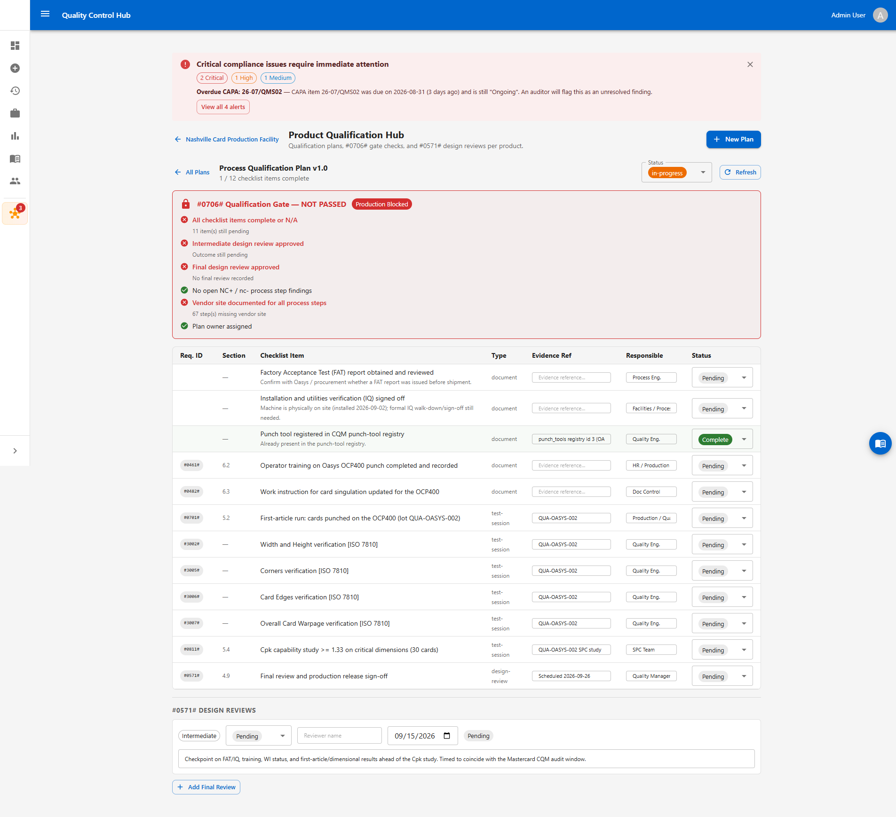
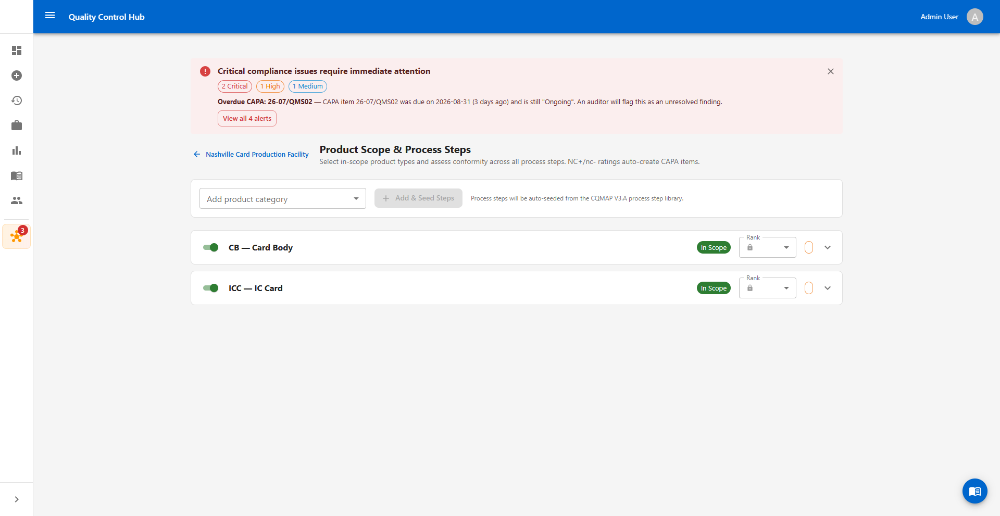

# Work Instruction — Qualifying New Production Equipment in NEXUS

**Document ID:** WI-NEXUS-EQUIP-001
**System:** Quality Control Hub — NEXUS Qualification Hub
**Standard:** Mastercard CQMAP V3.A (CQM Requirements 3a, Nov 2025)
**Audience:** Quality technicians and engineers with no prior NEXUS experience

---

## 1. Purpose

This work instruction walks you through what to do in NEXUS when a **new machine** arrives on the production floor — for example, a new punch, laminator, embosser, or bonder — and needs to be **qualified** before it can be used to make product that ships.

You do not need to already know what "Cpk," "#0706#," or "conformity" mean. Section 4 explains every term the first time it comes up. If you only remember one thing from this document, remember this:

> **A new machine cannot make shippable product until its qualification plan's gate shows PASSED.** Until then, keep production on the old, already-qualified machine.

## 2. Scope

Use this work instruction any time a **physical piece of production or test equipment** is installed, replaced, or significantly modified — not for qualifying a new card design (that has its own work instruction, `WI-NEXUS-QUAL-001`). This covers Site Acceptance Testing (SAT) and the equipment qualification checklist that follows it.

## 3. Roles & responsibilities

| Role | Responsibility |
|---|---|
| **Quality Manager** | Owns the qualification plan; assigns who does each checklist item; decides when the plan is promoted to `approved`. |
| **Process Engineer / Facilities** | Confirms the machine is installed correctly (IQ) and provides the Factory Acceptance Test (FAT) report. |
| **Quality Engineer / Technician** (you) | Runs the first-article cards through dimensional checks, enters results, keeps the checklist up to date. |
| **Quality Manager (Reviewer)** | Signs off the intermediate and final design reviews before production can switch to the new machine. |

## 4. Key terms

| Term | Plain-language meaning |
|---|---|
| **SAT** (Site Acceptance Test) | Proving the machine works correctly *here, in your building*, after installation — as opposed to a **FAT** (Factory Acceptance Test), which the equipment vendor runs at *their* factory before shipping it to you. |
| **IQ** (Installation Qualification) | A documented check that the machine is physically installed correctly — power, air, placement — before you try to run product on it. |
| **First article** | The first batch of real cards run on the new machine, set aside specifically to be measured and checked before you trust the machine with normal production. |
| **Cpk** | A single number that says how consistently a machine hits its target dimension. `Cpk ≥ 1.33` is the bar NEXUS requires — below that, the machine is not considered "in control" yet. |
| **Conformity** (`Full` / `RI` / `nc-` / `NC+`) | The finding for one line item. `Full` = meets requirement. `RI` = "Requires Improvement" — not yet meeting the bar but not a hard failure. `nc-`/`NC+` = a real non-conformity, worse as it goes toward `NC+`. A brand-new machine under qualification normally sits at `RI` until it passes. |
| **`#0706#` gate** | NEXUS's shorthand for the rule "only ship product made on a qualified process." Every qualification plan has a gate panel that is either **NOT PASSED** (production stays on the old machine) or **PASSED** (the new machine may be used for shippable product). |
| **Product scope** | Which CQM product category (e.g. `CB` — Card Body, `ICC` — IC Card) the plan is qualifying. If your new machine touches more than one product category, you need **one plan per category** — the gate is evaluated per product, not once for the whole site. |

## 5. The process at a glance

```
Machine physically installed
        │
        ▼
IQ (install/utilities) + FAT report obtained  ──►  document in the checklist
        │
        ▼
Operator training + work instructions updated
        │
        ▼
First-article run on the new machine
        │
        ▼
Dimensional checks (ISO 7810: width/height, corners, edges, warpage…)
        │
        ▼
Intermediate design review          [checkpoint]
        │
        ▼
Cpk capability study (≥ 1.33, ~30 cards)
        │
        ▼
Final design review — must be APPROVED
        │
        ▼
#0706# GATE — all conditions green ──► new machine may be used for production
```

Every box above is one or more rows on the qualification-plan checklist you will build in Section 7. Nothing here is optional or reorderable — the gate will not pass until every step is done.

## 6. Prerequisites

Before you start:

- You are signed in to the Quality Control Hub with a **Quality Manager**, **Auditor**, or **Admin** role.
- A NEXUS **audit record** already exists for your site (ask your Quality Manager if you are not sure — do not create a new one just for an equipment qualification).
- You know which CQM **product scope(s)** the new machine affects (e.g. it cuts card bodies used in both `CB` and `ICC` products). It is fine if those scopes have not been added to NEXUS yet — Step 2 below covers that.

## 7. Step-by-step procedure

### Step 1 — Open your site's audit record

From the left sidebar, open **NEXUS Hub**, then click into your facility's audit record.



> Notice the alert banner at the top — NEXUS automatically watches for overdue items and upcoming audits and puts the most urgent one right at the top. Check this banner every time you open the audit; it will tell you if something related to your equipment qualification has gone overdue.

### Step 2 — Make sure your product scope exists

A qualification plan has to be attached to a **product scope** (a CQM product category like `CB` — Card Body or `ICC` — IC Card) — the `#0706#` gate checks conformity against that specific product's process steps, so a plan cannot be usefully created without one. If your site's product scopes are already set up, skip to Step 3.

Open the audit record's **PRODUCT SCOPE** tab. Use the **Add product category** dropdown to pick the category your machine affects, then click **Add & Seed Steps**.



**Repeat once for every product category the machine feeds** (a card-cutting punch, for example, typically touches both `CB` and `ICC`). Each category you add auto-seeds roughly 90–120 process steps from the CQMAP V3.A library — you do not fill these in now, only the one your machine performs, later in Step 6.

> If this step is skipped, the **Product scope** dropdown in Step 4's "New Plan" dialog will be empty except for "None (audit-level)" — and a plan created with no scope can never pass its gate. If you already made that mistake, the fix is a two-line database update, not starting over — ask whoever set up NEXUS for you to link the existing plan to the correct scope once it exists.

### Step 3 — Open Qualification Plans

Click the **QUALIFICATION PLANS** tab. You will see every qualification plan for this site, newest first, each tagged with the product scope it covers and its current status (`in-progress`, `approved`, `rejected`, etc.).



> If an old plan exists for the same machine with dates that clearly did not happen (for example, it says the machine was installed on a date you know is wrong), do not edit it to "fix" the dates. Leave it as a record, set its status to `rejected`, and create a fresh plan instead — this keeps an honest history of what actually happened. Ask your Quality Manager if you are unsure whether an existing plan applies to your machine.

### Step 4 — Create one plan per affected product scope

Click **New Plan**. Fill in:

1. **Plan type** — choose **Process Qualification** (you are proving the *process on this machine* is capable, not redesigning the *card*).
2. **Product scope** — pick the product this plan covers, from the categories you added in Step 2. **If the machine feeds more than one product category, repeat this whole step-by-step procedure once per category** — do not try to cover two products with one plan.
3. **Owner** — the Quality Manager responsible for driving this plan to completion.

Click **Create & Seed**.



> The helper text under "Product scope" is not a suggestion — a plan with no scope selected can **never** pass its gate, because the gate has nothing to check conformity against. Always pick a scope. If the dropdown is empty, you skipped Step 2 — go do it now.

### Step 5 — Work the checklist

Open the plan you just created. You will see the gate panel at the top (still red — that is expected right now) and the checklist below it.



For each row:

- **Evidence Ref** — type in a document number, lot code, or reference proving the work happened (e.g. a FAT report number, or the lot code for your first-article cards).
- **Responsible** — who owns getting this specific line done.
- **Status** — leave `Pending` until real evidence exists, then move it to `In Progress` and finally `Complete`. **Never mark something complete before it has actually happened** — the gate exists to stop unqualified product, and a false "complete" defeats that purpose.

A typical equipment-qualification checklist looks like this, in order:

1. Factory Acceptance Test (FAT) report obtained and reviewed
2. Installation and utilities verification (IQ) signed off
3. Punch/production tool registered in the CQM tool registry
4. Operator training completed and recorded
5. Work instruction updated for the new machine
6. First-article run completed (note the lot code)
7. Dimensional checks per ISO 7810 (width/height, corners, edges, warpage — whichever apply to what this machine makes)
8. Cpk capability study, ≥ 1.33, on at least ~30 cards
9. Final review and production release sign-off

### Step 6 — Note the machine on the affected process step

Go back to the **PRODUCT SCOPE** tab you used in Step 2, then expand the product category your plan covers. Find the process step your new machine performs (for a card-cutting/punch machine, this is **`#G50# Card Singulation`**) and fill in:

- **Vendor Site** — your facility name/location.
- The conformity dropdown should read **`RI`** while qualification is in progress — this is correct and expected, not a mistake to fix.



There is a free-text notes area on this row (open the row detail) — use it to record which machine is doing this step now, e.g. *"New \[machine name/model] installed \[date] — qualification in progress; production remains on \[old machine] until sign-off."* This is what an auditor reads to understand what is happening on your floor right now.

### Step 7 — Record the design reviews

Still on the plan detail page, scroll to **Design Reviews**. Add an **Intermediate Review** once training, work instructions, and first-article results are in — this is a checkpoint, not the finish line. Later, once the Cpk study is done and everything looks good, add the **Final Review** and mark its outcome **`approved`**.

> The gate needs the intermediate review to be `approved` **or** `conditional`, and the final review to be `approved` — no other outcome will open the gate.

### Step 8 — Watch the gate, do not rush it

The gate panel checks six things in real time:

1. All checklist items complete or N/A
2. Intermediate design review approved (or conditional)
3. Final design review approved
4. No open `NC+`/`nc-` findings on the process step
5. Vendor site filled in for the process step
6. Plan owner assigned

**It is normal and expected for the gate to stay NOT PASSED for several weeks.** A real equipment qualification — training, a first-article run, dimensional checks, and a proper Cpk study — takes time. Do not shortcut steps to make the gate pass faster; that is exactly the failure mode this checklist exists to prevent. If a Mastercard audit happens to land while the gate is still open, that is fine — present the plan as an active, documented qualification and keep production on the already-qualified machine in the meantime.

### Step 9 — Promote the plan status as work finishes

Update the plan's **Status** dropdown as things progress: `draft → in-progress → submitted → approved` (or `rejected` if the machine fails qualification). Only set it to **approved** once the gate panel shows all six conditions green.

## 8. Completion criteria

The equipment qualification is done when:

- The gate panel shows **all six conditions passed** — no red "Production Blocked" banner.
- The final design review is recorded with outcome **approved**.
- The plan status is set to **approved**.
- The process step's conformity has been updated from `RI` to `Full`.

Only then should production switch from the old machine to the new one for shippable product.

---

## 9. Worked example — Oasys OCP400 die punch

This example is a real plan built in NEXUS, referenced throughout the screenshots above, so you can see exactly what a completed setup looks like in practice.

**Situation:** A new Oasys OCP400 high-speed punch (card singulation — cuts finished cards out of laminated sheets, ±0.1mm tolerance, up to 60,000 cards/hour) was installed on the floor to eventually replace an older punch. It affects two product categories: `CB` (card body) and `ICC` (finished IC cards).

**What was set up:**
- The `CB` and `ICC` product scopes (Step 2) — on a freshly created audit record, neither existed yet, so the "Product scope" dropdown in the New Plan dialog was empty until these were added.
- Two Process Qualification plans — one for `CB`, one for `ICC` — because the `#0706#` gate is evaluated per product, and a machine feeding two product lines needs two plans.
- A 9-line checklist on each plan: FAT report, IQ sign-off, tool registration, operator training, work instruction update, first-article run, four ISO 7810 dimensional checks, a Cpk study, and final sign-off.
- The `#G50#` process step on both product scopes updated to show the new machine, `RI` conformity, and the site name.
- An intermediate design review scheduled as a checkpoint.

**What was deliberately left alone:** only the checklist line that was independently verifiable (the tool registry entry) was marked complete. Everything else — training, the FAT report, first-article results, the Cpk study — was left `Pending` with a realistic target date, because none of it had actually happened yet. **Do the same on your own machine: only mark a line complete when you can point to real evidence.**

## 10. Reference

- `docs/qualification-work-instructions.md` (WI-NEXUS-QUAL-001) — the related work instruction for qualifying a *card product/design*, as opposed to a *machine*.
- `docs/nexus-qualification-hub.md` — how the NEXUS Qualification Hub maps to the Mastercard CQMAP V3.A requirements catalog.

## 11. Revision history

| Version | Date | Author | Notes |
|---|---|---|---|
| 1.0 | 2026-09-03 | Quality Control Hub | Initial issue, written against the Oasys OCP400 die-punch equipment qualification. |
| 1.1 | 2026-09-03 | Quality Control Hub | Added Step 2 (create the product scope before creating a plan) — the original issue assumed product scopes already existed and did not explain how to add them, which left the "New Plan" dialog's Product scope dropdown empty on a freshly created audit. |
