# NEXUS Hub — Work Instruction

**Document ID:** WI-NEXUS-001  
**Revision:** 2.0  
**Effective Date:** 2026-05-04  
**Owner:** Quality Systems  
**Classification:** Internal

---

## Table of Contents

1. [Purpose and Scope](#1-purpose-and-scope)
2. [Definitions and Terminology](#2-definitions-and-terminology)
3. [System Access](#3-system-access)
4. [NEXUS Hub Dashboard](#4-nexus-hub-dashboard)
5. [Creating Your Audit Record](#5-creating-your-audit-record)
6. [Audit Detail — Overview Tab](#6-audit-detail--overview-tab)
7. [QMS Assessment Tab — Self-Assessment](#7-qms-assessment-tab--self-assessment)
8. [Product Scope & Process Steps Tab](#8-product-scope--process-steps-tab)
9. [CAPA — Internal Corrective Action Tracking](#9-capa--internal-corrective-action-tracking)
10. [Qualification Plans Tab](#10-qualification-plans-tab)
11. [Document Register Tab](#11-document-register-tab)
12. [Components Registry Tab](#12-components-registry-tab)
13. [Compliance Alerts](#13-compliance-alerts)
14. [AI Readiness Check](#14-ai-readiness-check)
15. [Audit Grade and Scheduling Logic](#15-audit-grade-and-scheduling-logic)
16. [Continuous Audit Readiness — The Annual Cycle](#16-continuous-audit-readiness--the-annual-cycle)

---

## 1. Purpose and Scope

### 1.1 Why This System Exists

The **NEXUS Hub** is our internal audit readiness tool. As a card manufacturing facility subject to periodic CQM audits under the Mastercard CQMAP V3.A framework, we use the NEXUS Hub to continuously track and improve our own compliance — so that when an external auditor arrives, we already know exactly where we stand.

The core idea is simple: **we run a continuous internal audit against ourselves using the same framework and criteria the external auditor will use.** Every finding we identify and close before the external audit is one fewer finding on the official record. Every CAPA we drive to closure is evidence that our quality system is self-correcting — which is itself a positive audit signal.

### 1.2 Our Role in the System

We are the manufacturing facility being assessed, not the auditor. This means:

- We fill in the **self-assessment** fields in the QMS Assessment (what we do, what evidence we have)
- We make **honest conformity self-ratings** — if we find a gap, we rate it nc- or NC+ on ourselves
- We manage our own **CAPA items** as internal corrective actions
- We maintain our own **document register** and **component supplier list** year-round
- The **external auditor** sets the final Grade and formally closes the audit record

The NEXUS Hub is our preparation infrastructure. We own the content; the auditor reviews it.

### 1.3 Scope

This work instruction applies to all Quality Engineering staff responsible for maintaining CQM audit readiness at our facility. It covers all product categories we manufacture (CB, ICC, P, ICM, IL as applicable).

---

## 2. Definitions and Terminology

| Term | Definition |
|------|-----------|
| **CQMAP V3.A** | Mastercard Card Quality Management Assessment Program, version 3.A — the framework used for CQM audits |
| **Audit Record** | Our facility's digital compliance file in the NEXUS Hub — one record per audit cycle |
| **Self-Assessment** | Our internal evaluation of our own QMS against each CQMAP requirement, conducted before the external audit |
| **Audit Cycle** | The period between one external CQM audit and the next (6–24 months depending on grade) |
| **QMS Assessment** | The requirement-by-requirement conformity tracking table — the heart of our self-assessment |
| **Requirement ID** | A unique CQMAP requirement identifier (e.g., `#0521#`, `#0583#`) |
| **Conformity Rating** | Our honest self-rating of how well we meet a requirement (see table below) |
| **NC+** | Major non-conformity — a significant gap requiring immediate corrective action; blocks Grade A/B |
| **nc-** | Minor non-conformity — a gap requiring corrective action within an agreed timeline |
| **RI** | Room for Improvement — an observation worth improving; no formal corrective action required |
| **Full** | Fully conforming — we have evidence that satisfies the requirement |
| **NCC** | Not currently certified — requirement is outside our current certification scope |
| **Audit Grade** | The overall quality rating assigned by the external CQM auditor: A (highest), B, C, or D |
| **Gate #0706#** | Six-condition qualification gate that must pass before a product can be ranked A, B, or C |
| **CAPA** | Corrective and Preventive Action — our documented response to any nc- or NC+ finding |
| **CB** | Card Body — the physical card substrate manufacturing process |
| **ICC** | Integrated Circuit Card — IC chip embedding and card assembly |
| **P** | Personalisation — card personalisation and fulfilment |
| **ICM** | IC Module — chip module preparation |
| **IL** | Inlay — antenna/inlay assembly for contactless cards |

---

## 3. System Access

### 3.1 Logging In

Open a web browser and navigate to the CQM Quality Control Hub. Log in with your CQM username and password.

> **Permissions:** Quality Engineers can create and edit audit records, self-assessment data, CAPAs, documents, and components. Read-only users can view the record but cannot modify data.

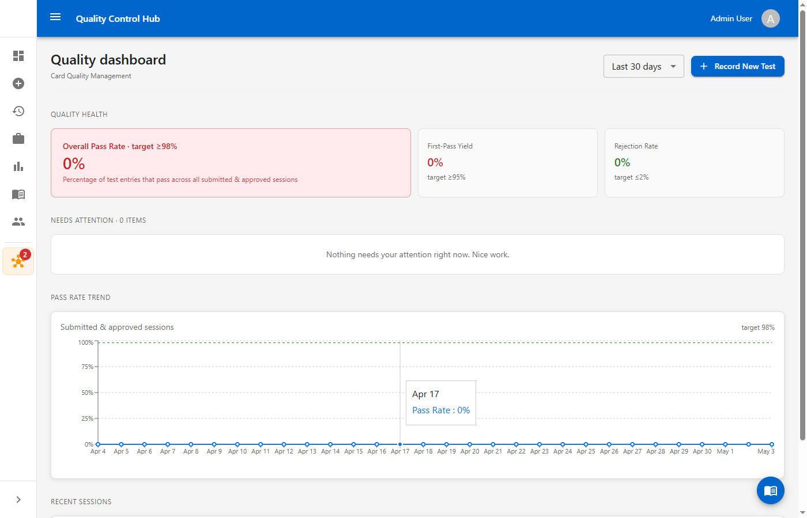
*Figure 1 — CQM Quality Control Hub main dashboard*

### 3.2 Navigating to NEXUS Hub

Click the **NEXUS Hub** button in the left sidebar (star/asterisk icon). If there are unread compliance alerts, a red badge shows the count.

---

## 4. NEXUS Hub Dashboard

The NEXUS Hub landing page shows the current status of our compliance programme at a glance.

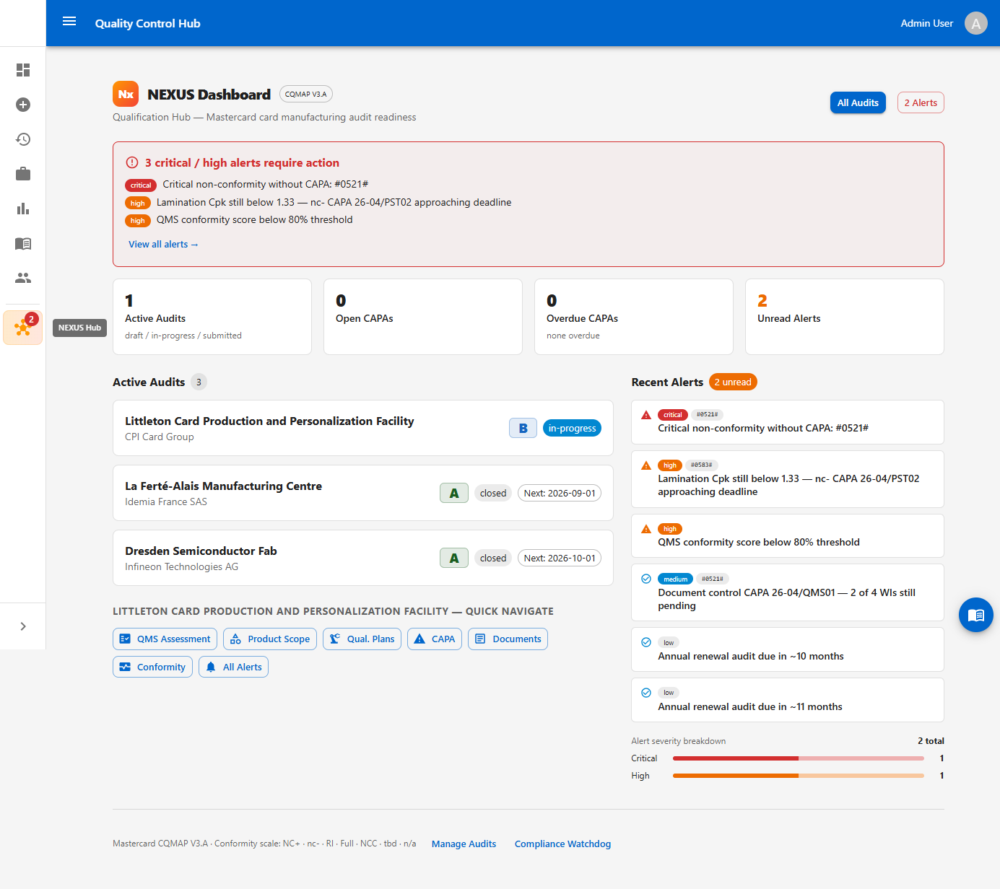
*Figure 2 — NEXUS Hub dashboard showing audit cycle status, KPI tiles, and active alerts*

### 4.1 KPI Tiles

| Tile | What it tells us |
|------|-----------------|
| **Active Audits** | Audit records currently in Draft or In-Progress — typically just our current cycle record |
| **Open CAPAs** | Internal corrective actions not yet closed — our to-do list |
| **Overdue CAPAs** | CAPAs past their self-assigned deadline — requires immediate attention |
| **Unread Alerts** | Compliance alerts not yet reviewed |

### 4.2 Our Audit Record Card

Our facility's audit record appears as a card showing the site name, current status, grade from the last external audit, and next scheduled audit date. Click it to open the full record.

### 4.3 Alerts Panel

Recent unread compliance alerts are shown on the right. Click **View all alerts →** for the full list. Alerts are our early-warning system — see Section 13.

---

## 5. Creating Your Audit Record

A new audit record is created at the start of each audit cycle — typically shortly after the previous external audit closes, or when preparing for a first audit.

### 5.1 Opening the Form

From the NEXUS Hub dashboard, click **+ New Audit**.

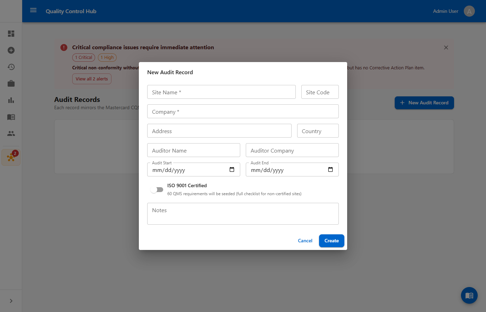
*Figure 3 — New Audit Record creation form*

### 5.2 Completing the Coversheet

| Field | What to enter |
|-------|--------------|
| **Site Name** | The formal name of our manufacturing facility |
| **Company** | Our legal entity name |
| **Address** | Full postal address of the facility |
| **Country** | Country where the facility is located |
| **Site Code** | Our CQM-assigned site identifier |
| **Auditor Name** | Leave blank until the external auditor is confirmed; fill in when known |
| **Auditor Company** | Leave blank until confirmed |
| **Audit Start Date** | Planned or confirmed start date of the upcoming external audit |
| **Audit End Date** | Planned or confirmed end date |
| **ISO 9001 Certified** | Toggle ON if our facility holds a current ISO 9001 certificate |
| **Notes** | Any relevant context about this audit cycle (scope changes, new product lines, etc.) |

### 5.3 ISO 9001 Toggle and Requirement Set

The **ISO 9001 Certified** toggle determines which CQMAP requirements are loaded into our QMS Assessment:

- **Toggle ON** — Full requirement set including ISO 9001-mapped clauses (~31 requirements)
- **Toggle OFF** — Non-ISO subset of CQMAP requirements

> **Important:** The requirement set is seeded when the record is saved and cannot be changed after creation. Confirm ISO certification status before saving.

### 5.4 Saving the Record

Click **Create Audit Record**. The system creates the record in Draft status and automatically populates the QMS Assessment with all applicable requirements. We are ready to begin self-assessment.

---

## 6. Audit Detail — Overview Tab

Every audit record opens on the Overview tab. The tab bar across the top gives access to all sections.

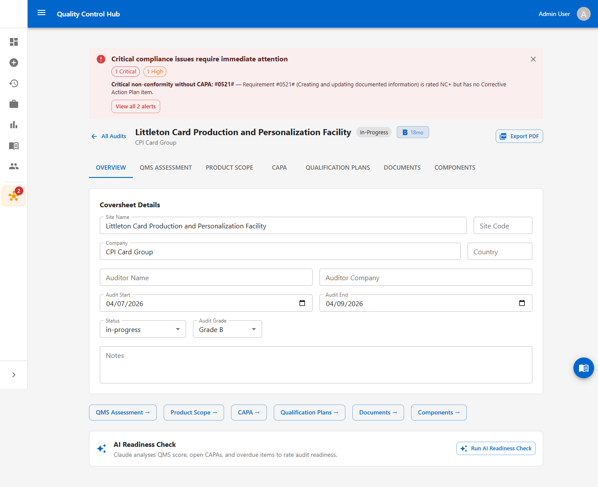
*Figure 4 — Audit detail overview showing the tab bar, coversheet, and status fields*

### 6.1 Tab Navigation

| Tab | What we use it for |
|-----|-------------------|
| **Overview** | Coversheet, status, grade tracking, AI Readiness Check |
| **QMS Assessment** | Our continuous self-assessment against all CQMAP requirements |
| **Product Scope** | Our manufacturing processes and process step conformity |
| **CAPA** | Our internal corrective action tracker |
| **Qualification Plans** | Product qualification plans and Gate #0706# evidence |
| **Documents** | Our controlled document register linked to requirements |
| **Components** | Our component supplier and subcontractor list |

### 6.2 Status — Tracking Where We Are in the Cycle

We control the status field throughout the year. Set it to reflect the true state of our record:

| Status | When we set it |
|--------|---------------|
| **Draft** | Record just created; initial data entry in progress |
| **In-Progress** | Active self-assessment underway — the normal working state for most of the cycle |
| **Submitted** | We have completed our preparation and submitted the record for external review |
| **Closed** | External audit complete; grade confirmed. We then open a new record for the next cycle |

### 6.3 Grade Field

The **Audit Grade** (A, B, C, or D) is set by the **external CQM auditor** after the audit visit — not by us. We can see and track it, but we do not assign it ourselves. The grade drives the next audit interval (see Section 15).

### 6.4 Compliance Alert Banner

If the system has detected critical issues — an NC+ self-rating without a CAPA, an overdue corrective action — a red banner appears at the top of the page. This is our signal to act before the situation worsens. Click **View all alerts** to see the full list.

### 6.5 Quick-Navigation Buttons

At the bottom of the Overview tab, shortcut buttons go directly to each other section: **QMS Assessment →**, **Product Scope →**, **CAPA →**, **Qualification Plans →**, **Documents →**, **Components →**.

---

## 7. QMS Assessment Tab — Self-Assessment

The QMS Assessment tab is the core of our compliance work. This is where we evaluate ourselves against every CQMAP requirement, honestly and regularly.

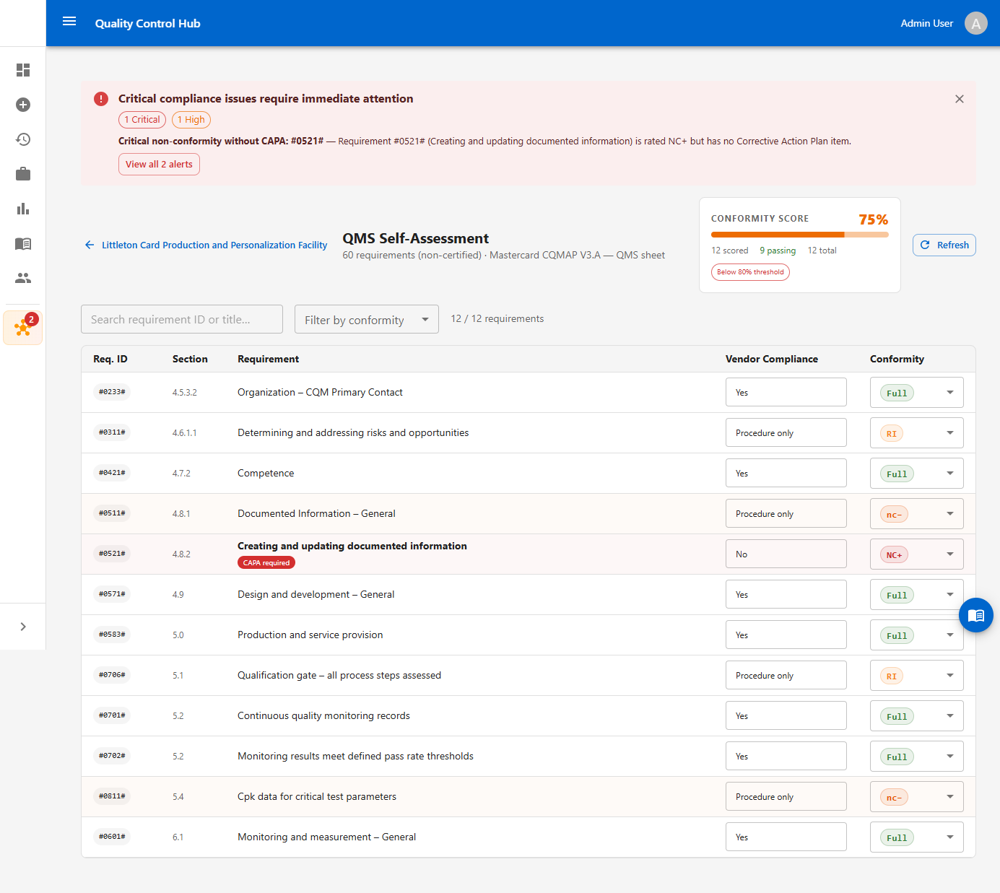
*Figure 5 — QMS Assessment tab showing self-assessed conformity ratings, evidence references, and CAPA indicators*

### 7.1 The Self-Assessment Mindset

We approach this tab the same way an external auditor would: for each requirement, we ask *"Do we actually meet this? What evidence do we have? If an auditor asked us to demonstrate this right now, could we?"* If the honest answer is no — or not fully — we rate it accordingly. A gap we find and fix ourselves is far better than one the auditor finds.

### 7.2 Assessment Grid Columns

| Column | Our responsibility |
|--------|--------------------|
| **Req. ID** | CQMAP identifier — read-only, seeded automatically |
| **Section** | CQMAP section number — read-only |
| **Title** | Requirement description — read-only |
| **ISO 9001** | Whether this maps to an ISO 9001 clause — informational |
| **Vendor Compliance** | **We fill this** — describe how we comply (e.g., "Procedure QP-007 Rev 3 in place") |
| **Evidence Ref** | **We fill this** — the document, record, or system reference that proves compliance |
| **Conformity** | **Our honest self-rating** — see Section 7.3 |
| **Auditor Comment** | Left blank during self-assessment; the external auditor may add comments here |

### 7.3 Setting Our Conformity Self-Rating

For each requirement, select the rating that honestly reflects our current position:

| Rating | When to use it |
|--------|---------------|
| **tbd** | Not yet self-assessed — the default; work through these systematically |
| **Full** | We fully comply; evidence is current, controlled, and readily available |
| **RI** | We comply but there is room to improve; no formal finding needed |
| **nc-** | We have a minor gap — a CAPA is automatically created for us to track resolution |
| **NC+** | We have a significant gap — a CAPA is automatically created; this blocks Grade A/B |
| **NCC** | This requirement is outside our current certification scope |
| **n/a** | This requirement genuinely does not apply to our facility or processes |

> **When in doubt, rate lower.** It is far better to self-identify an nc- and drive it to closure before the external audit than to rate it Full and have the auditor disagree. An honest self-assessment with resolved CAPAs is one of the strongest signals of a mature quality system.

### 7.4 Auto-CAPA Creation

When we set a rating to **nc-** or **NC+**, the system automatically creates a CAPA entry in the CAPA tab. We must then navigate to the CAPA tab to:
- Write a clear, specific observation describing the gap
- Set a realistic deadline for resolution
- Assign responsibility

### 7.5 Conformity Score

The header shows a live score — the percentage of assessed requirements rated Full or RI. This is the number the external auditor will use as a baseline. Our target before the external audit:

| Target Grade | Conformity Score to Aim For |
|-------------|----------------------------|
| A | ≥ 90% |
| B | ≥ 80% |
| C | ≥ 70% |

### 7.6 Keeping the Assessment Current

The QMS Assessment is not a once-a-year exercise. Whenever we update a procedure, complete a CAPA, add new evidence, or change a process, we update the relevant row. The assessment should reflect our *current* position at all times.

---

## 8. Product Scope & Process Steps Tab

This tab defines what we manufacture and tracks our self-assessed conformity for each step of our manufacturing process.

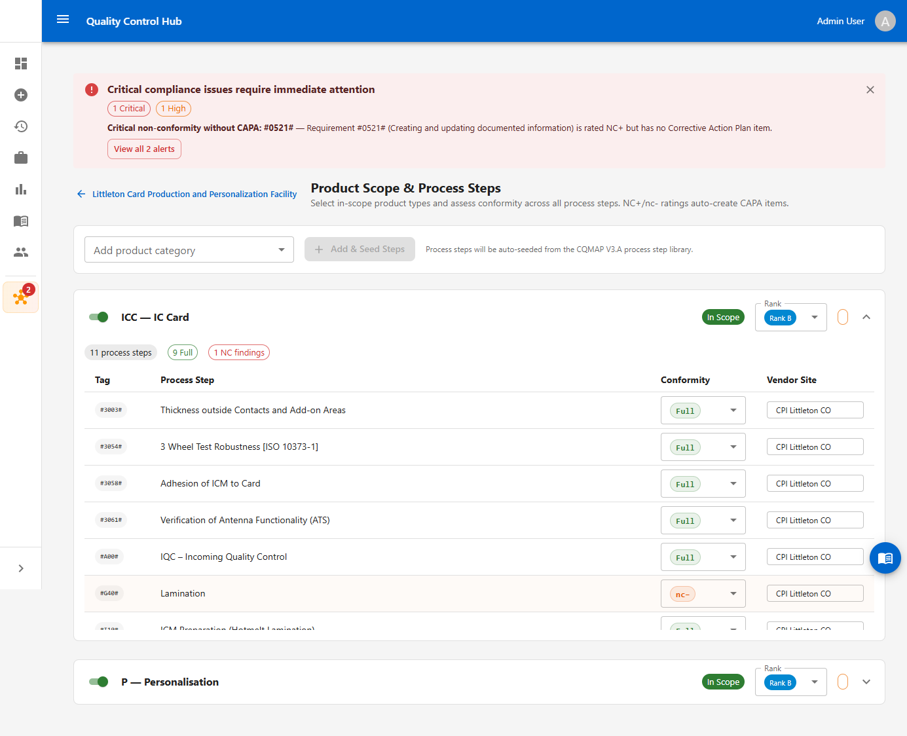
*Figure 6 — Product Scope tab showing our manufacturing categories with process steps and conformity ratings*

### 8.1 Setting Up Our Product Scope

When the audit record is first created:
1. Click **Add product category**
2. Select each category that applies to our facility (CB, ICC, P, ICM, IL)
3. Click **+ Add & Seed Steps**

The system loads all CQMAP V3.A process steps for that category. Only add categories we actually perform — do not add categories that are out of scope for our facility.

### 8.2 Assessing Our Process Steps

For each process step, we walk our own floor and ask: does our process meet this standard?

1. Set the **Conformity** rating (same scale as the QMS Assessment)
2. Enter the **Vendor Site** field as our own facility name
3. If we rate a step nc- or NC+, the system creates a CAPA — complete it immediately with the specific gap and a deadline

This is our internal process audit. Do it honestly. Steps that we rate nc- and then close before the external audit demonstrate exactly the kind of self-correcting quality system that earns a Grade A.

### 8.3 Keeping Steps Current

When we change a process, qualify a new step, or close a related CAPA, update the process step conformity. The Product Scope tab should reflect the current state of our production floor.

### 8.4 Product Rank

Each product category has a Rank field (A, B, C, or D). The external auditor sets this based on our self-assessment, process step conformity, and Gate #0706# status. We track it here but do not assign it ourselves.

> **Gate #0706# Requirement:** A product cannot be ranked A, B, or C until all six Gate #0706# conditions pass. See Section 10 for the full gate checklist.

---

## 9. CAPA — Internal Corrective Action Tracking

The CAPA tab is our internal corrective action and non-conformance management log. It captures every gap we identify — whether through self-assessment, process monitoring, customer feedback, or internal audit.

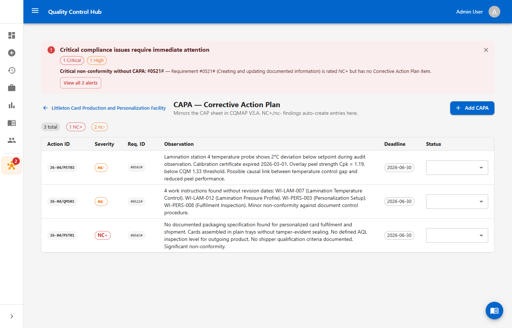
*Figure 7 — CAPA tab showing active corrective actions with severity, observation, deadline, and status*

### 9.1 How CAPAs Are Created

CAPAs are created two ways:

- **Automatically** — when we rate a QMS requirement or process step as nc- or NC+ in the self-assessment
- **Manually** — by clicking **+ Add CAPA** for any gap we identify that falls outside a specific requirement (e.g., a process observation from an internal walk-through, a customer complaint, a near-miss)

Both are valid and encouraged. The CAPA log should capture everything we know about our own gaps.

### 9.2 CAPA Entry Fields

| Field | What to enter |
|-------|--------------|
| **Action ID** | Auto-generated (e.g., `26-04/PST01`) — do not edit |
| **Severity** | NC+ or nc- — inherited from the triggering rating, or set manually for manual CAPAs |
| **Req. ID** | The CQMAP requirement or process step tag (e.g., `#0583#`) |
| **Observation** | **Write a clear, specific description of the gap** — what is missing, what evidence is lacking, what was observed. Be specific enough that someone unfamiliar with the issue understands exactly what the problem is |
| **Deadline** | Set a realistic date by which we will close the CAPA. Be honest — an overdue CAPA is worse than a longer deadline |
| **Status** | Track progress honestly through the workflow |

### 9.3 CAPA Status Workflow

Move each CAPA through the following stages as work progresses:

| Status | When to set it |
|--------|---------------|
| **Not yet started** | CAPA created; no action taken yet |
| **In progress** | We are actively working on the corrective action |
| **Under Review** | Corrective action is complete; we are verifying effectiveness |
| **Awaiting Auditor** | We believe it is resolved and are ready for external verification |
| **Closed** | Confirmed resolved — either by ourselves (for nc-) or the external auditor (for NC+) |

### 9.4 The NC+ Without CAPA Alert

If any requirement is rated NC+ but has no CAPA, the system raises a **Critical** alert and displays a red banner throughout the audit record. This is never acceptable — every NC+ must have a CAPA. Address this immediately by either adding the CAPA or reconsidering the rating.

### 9.5 CAPA as Evidence

A well-managed CAPA log is one of the most valuable things we can show an external auditor. It demonstrates:
- We find our own problems (self-awareness)
- We document them formally (process discipline)
- We close them within committed timelines (execution)
- We verify the fix worked (effectiveness)

Aim to have no open NC+ CAPAs and all nc- CAPAs in progress or closed before the external audit.

---

## 10. Qualification Plans Tab

The Qualification Plans tab manages our product qualification plans and tracks the Gate #0706# evidence for each product we manufacture.

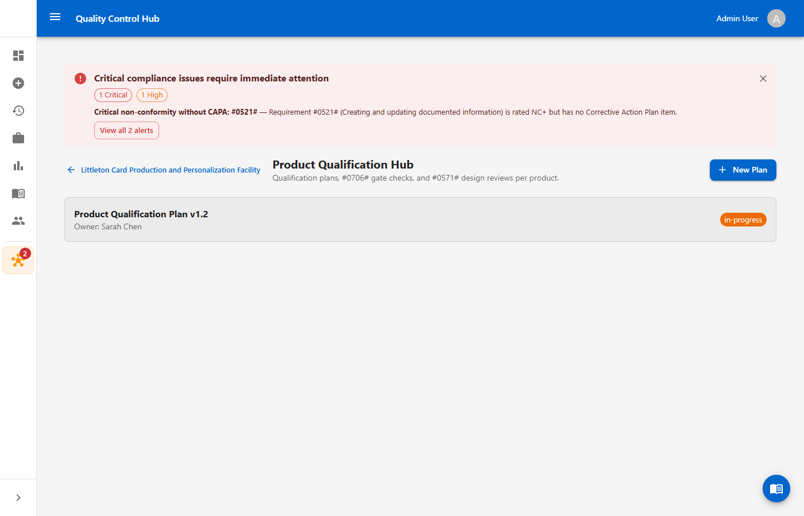
*Figure 8 — Qualification Plans showing a plan in-progress with owner and status*

### 10.1 Creating a Qualification Plan

Click **+ New Plan** and complete:
- **Plan Name** — e.g., "Credit Card Qualification Plan v1.2"
- **Owner** — the Quality Engineer responsible for driving this plan
- **Status** — Draft, In-Progress, or Complete

### 10.2 Gate #0706# — The Six Conditions

Before any product can be ranked A, B, or C in Product Scope, all six gate conditions must be satisfied. We track evidence for each:

| # | Gate Condition | Evidence Type |
|---|---------------|---------------|
| 1 | All process steps assessed | Completed process step assessment in Product Scope tab |
| 2 | Continuous quality monitoring records available | Test session records in the CQM system |
| 3 | Monitoring results meet defined pass rate thresholds | Test session pass rate data |
| 4 | SPC evidence — control charts and Cpk ≥ 1.33 for critical parameters | SPC reports |
| 5 | Cpk data available for critical test parameters | Capability study data |
| 6 | Intermediate and final design reviews completed and signed off | Design review records |

When all six are satisfied, the gate passes and the external auditor can assign a rank of A, B, or C to that product.

---

## 11. Document Register Tab

The Document Register is our controlled document list linked to CQMAP requirements. It is the digital equivalent of maintaining a live document evidence portfolio.

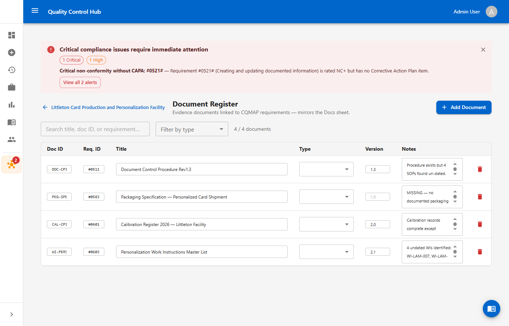
*Figure 9 — Document Register showing evidence documents linked to CQMAP requirements*

### 11.1 What to Register

For each CQMAP requirement we rate as Full or RI, there should be at least one entry in the Document Register that evidences that rating. Common document types:

| Requirement area | Typical evidence |
|-----------------|-----------------|
| Document control | Document Control Procedure, master document list |
| Calibration | Calibration register, calibration certificates |
| Training | Training records, competency matrix |
| Work instructions | Controlled SOPs/WIs for each process step |
| Non-conformance | CAPA procedure, NCR log |
| Internal audit | Internal audit schedule, reports |

### 11.2 Adding a Document

Click **+ Add Document** and complete the row:

| Field | What to enter |
|-------|--------------|
| **Doc ID** | Our internal document reference number (e.g., `QP-007`, `WI-LAM-003`) |
| **Req. ID** | The CQMAP requirement this document evidences |
| **Title** | Full document title |
| **Type** | Procedure, Work Instruction, Record, Certificate, Register, etc. |
| **Version** | Current revision |
| **Notes** | Any relevant notes — e.g., "Under revision", "Renewal due Q3 2026", "Submitted to auditor" |

### 11.3 Identifying and Addressing Document Gaps

If a requirement is rated Full but no corresponding document is registered, we have an evidence gap. Use the Notes field to flag it: `MISSING — [reason]`. This signals to the team that a document needs to be created or located before the audit.

Document gaps that represent real compliance shortfalls should be reflected as nc- or RI in the QMS Assessment and driven through CAPA.

### 11.4 Keeping It Current

Review the Document Register at least quarterly and before the external audit. For every document, verify:
- The version number is current
- The document is formally controlled (approved, dated, revision-controlled)
- The document is accessible and ready to present

---

## 12. Components Registry Tab

The Components Registry lists all external suppliers and subcontractors whose materials or sub-assemblies go into our card products. This mirrors the Components sheet of CQMAP V3.A.

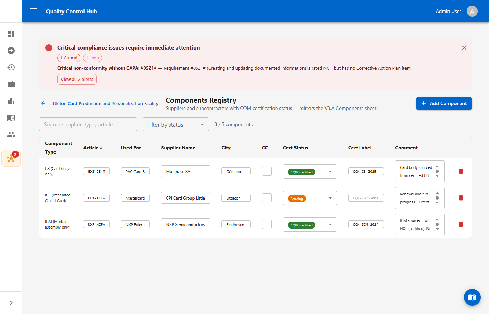
*Figure 10 — Components Registry showing our component suppliers with CQM certification status*

### 12.1 What to Register

Register every external component supplier whose material becomes part of our finished card product. This includes:
- Card body (PVC, polycarbonate) suppliers
- IC module suppliers
- Inlay/antenna suppliers
- Overlay/laminate suppliers
- Any sub-contracted processing (e.g., a third-party personalisation bureau)

### 12.2 Component Entry Fields

| Field | What to enter |
|-------|--------------|
| **Component Type** | CB, ICC, ICM, IL, or P — the product category this component feeds |
| **Article #** | Supplier's article or part number |
| **Used For** | What our product uses this component for |
| **Supplier Name** | Full company name |
| **City** | Supplier's city |
| **Cert Status** | CQM Certified, Pending, Not Certified, or Exempt |
| **Cert Label** | Supplier's CQM certificate reference number |
| **Comment** | Renewal dates, qualifications in progress, notes |

### 12.3 Certification Status

| Status | Meaning and our action |
|--------|----------------------|
| **CQM Certified** | Supplier holds a current certificate — no action needed unless renewal is approaching |
| **Pending** | Certification in progress — track progress and update when issued |
| **Not Certified** | Not CQM certified — flag for review; may require qualification or alternative sourcing |
| **Exempt** | Formally exempted — document the basis for exemption in Comments |

### 12.4 Keeping It Current

Update the Components Registry whenever we qualify a new supplier, receive a supplier's renewed certificate, or make a component change. An outdated registry is an audit finding waiting to happen.

---

## 13. Compliance Alerts

The Compliance Alerts page is our automated compliance watchdog. It runs every 15 minutes and checks all our data against key compliance rules, surfacing issues before they become audit findings.

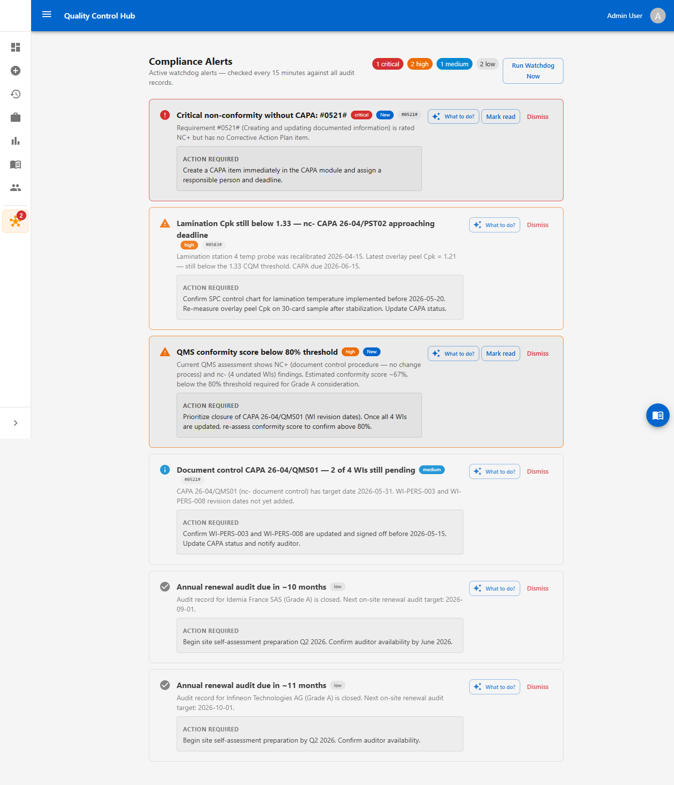
*Figure 11 — Compliance Alerts page showing alerts at different severity levels with action guidance*

### 13.1 Alert Severity Levels

| Severity | What it means for us |
|----------|---------------------|
| **Critical** | An NC+ self-rating with no CAPA exists. This must be resolved immediately — it would be a major finding in any external audit |
| **High** | A CAPA is approaching or past its deadline, or our QMS score has dropped below 80%. Escalate and act within days |
| **Medium** | A CAPA is partially overdue or document gaps have been flagged. Address within the week |
| **Low** | Our renewal audit is approaching (~10–12 months out). Begin preparation planning |

### 13.2 Acting on Alerts

Each alert has an **ACTION REQUIRED** panel that tells us exactly what to do. Click **What to do?** to expand it.

| Button | When to use it |
|--------|---------------|
| **What to do?** | Expands the guided action panel — always read this first |
| **Mark read** | Acknowledge the alert; it remains visible but no longer counts as unread |
| **Dismiss** | Dismiss the alert if the condition has been resolved or is no longer applicable |

### 13.3 Using Alerts as a Work Queue

Review the Alerts page at the start of each week. Treat unread critical and high alerts as immediate action items. Treat medium alerts as the current week's work queue. Low alerts are planning inputs.

The unread alert count on the NEXUS Hub sidebar button is our health indicator — aim to keep it at zero.

### 13.4 Run Watchdog Now

After resolving a CAPA or updating a conformity rating, click **Run Watchdog Now** to force an immediate re-check. Confirm that the alert clears before considering the item closed.

---

## 14. AI Readiness Check

The AI Readiness Check is an on-demand analysis available from the Overview tab. It reads our live audit record data and produces a written readiness assessment.

### 14.1 What It Analyses

- Our current QMS conformity score and what is driving it down
- Open and overdue CAPAs and their risk to the upcoming audit
- Product scope rank eligibility against Gate #0706#
- Key risks to achieving or maintaining our target grade

### 14.2 Running the Check

From the Overview tab, click **Run AI Readiness Check**. The report appears within a few seconds. It is advisory — it does not change any data in the record.

### 14.3 When to Run It

| Timing | Purpose |
|--------|---------|
| **6 months before the external audit** | Identify major gaps while there is still time to address them |
| **3 months before** | Check progress; confirm preparation is on track |
| **4–6 weeks before** | Final readiness check; identify any remaining open items |
| **After closing a major CAPA** | Confirm the improvement is reflected in the score |

---

## 15. Audit Grade and Scheduling Logic

### 15.1 Grade Criteria

The external auditor assigns our grade based on their review of our self-assessment, process step findings, and CAPA status. The grade criteria the auditor uses:

| Grade | QMS Conformity | NC+ Findings | CAPA Health |
|-------|---------------|-------------|-------------|
| **A** | ≥ 90% Full/RI | None | All closed |
| **B** | ≥ 80% Full/RI | None open | All nc- within deadline |
| **C** | ≥ 70% Full/RI | Resolved or mitigated | Tracked with plans |
| **D** | Below 70% or systemic gaps | May be present | Must be initiated |

These thresholds are our targets for self-assessment. If our self-rated score is below our target grade threshold, we know we have work to do before the audit.

### 15.2 Next Audit Date

Once the external auditor sets our grade and closes the record, the system calculates our next audit date automatically:

| Grade Achieved | Next Audit In |
|---------------|--------------|
| A | 24 months |
| B | 18 months |
| C | 12 months |
| D | 6 months |

Achieving Grade A gives us the longest cycle — two full years. This is why maintaining strong self-assessment discipline throughout the cycle pays off.

---

## 16. Continuous Audit Readiness — The Annual Cycle

Unlike a vendor managed by someone else, we own our audit record from start to finish. The goal is that our NEXUS Hub record is never more than a few weeks out of date — so at any point in the cycle, we could hand it to an auditor and be confident it reflects reality.

### 16.1 Opening a New Audit Cycle

Immediately after an external audit closes, open a new audit record for the next cycle:
1. Create the record with the next planned audit dates (even if provisional)
2. Set status to **In-Progress**
3. Roll forward any unresolved items from the previous cycle into new CAPAs
4. Begin updating the QMS Assessment to reflect the current state

### 16.2 Ongoing Maintenance (Throughout the Year)

**Monthly:**
- Review open CAPAs — update status, escalate anything drifting past deadline
- Check the Alerts page — address all critical and high alerts
- Update the Document Register when documents are revised or renewed
- Update process step conformity if any process changes occurred

**Quarterly:**
- Run a full review of the QMS Assessment — update Vendor Compliance, Evidence Ref, and Conformity for any requirement where something has changed
- Update the Components Registry for any supplier changes or certificate renewals
- Run the AI Readiness Check to sense-check our overall position

### 16.3 Pre-Audit Preparation (3–6 Months Before)

1. **Run the AI Readiness Check** — identify all gaps, prioritise by severity and effort
2. **Drive all NC+ CAPAs to Closed** — no NC+ findings should be open when the auditor arrives
3. **Progress all nc- CAPAs** — aim for Closed or at minimum Under Review
4. **Review every tbd in the QMS Assessment** — every row must have a rating before the external audit
5. **Audit the Document Register** — verify every registered document is current, controlled, and accessible
6. **Verify Gate #0706# conditions** — confirm all six conditions are met for every product we want ranked A/B/C
7. **Update the Components Registry** — confirm certification status for all suppliers
8. **Set status to Submitted** when preparation is complete

### 16.4 During the External Audit

- Share the NEXUS Hub record with the external auditor as the primary evidence package
- The auditor reviews our self-assessment, verifies evidence, and may adjust conformity ratings based on their findings
- Any new findings the auditor identifies will be added as NC+ or nc- and auto-generate CAPAs
- After the visit, the auditor sets the final Grade and transitions the record to **Closed**

### 16.5 After the External Audit

- Review any adjustments the auditor made to our conformity ratings — these are areas where our self-assessment needs recalibration
- Ensure all CAPA items raised by the auditor have clear owners and deadlines
- Open the next cycle audit record (Section 16.1)
- Note the new next-audit date — set a calendar reminder for the 6-month preparation start

### 16.6 Grade A Audit — What It Looks Like

The following shows an example of a closed Grade A audit record. The conformity score was high, no NC+ findings were present, all CAPAs were closed, and the facility is rewarded with a 24-month renewal interval.

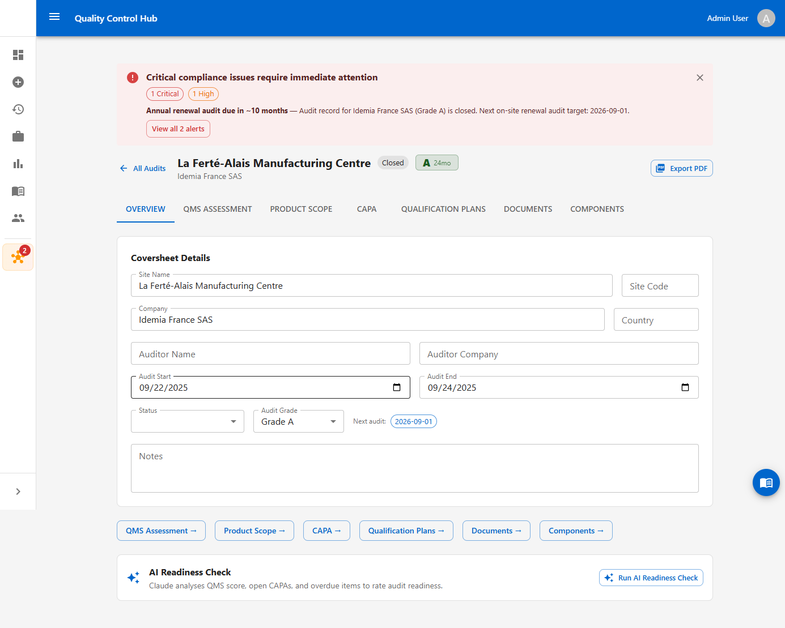
*Figure 12 — Example of a closed Grade A audit record showing the 24-month renewal cycle*

This is our target state at the close of every external audit — a clean record, all findings resolved, and the longest possible time before the next scheduled audit.

---

*End of Work Instruction WI-NEXUS-001 Rev 2.0*

*For questions or updates, contact the Quality Systems team.*
