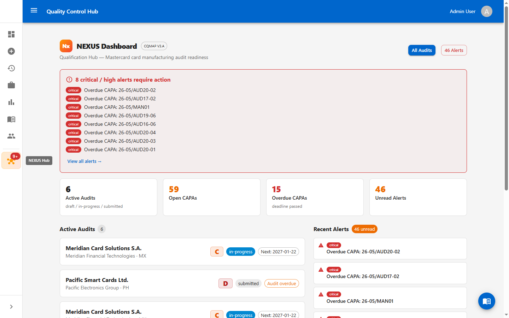
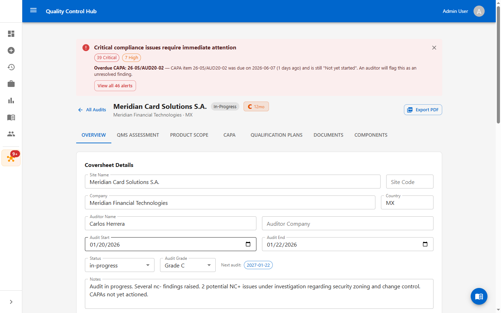
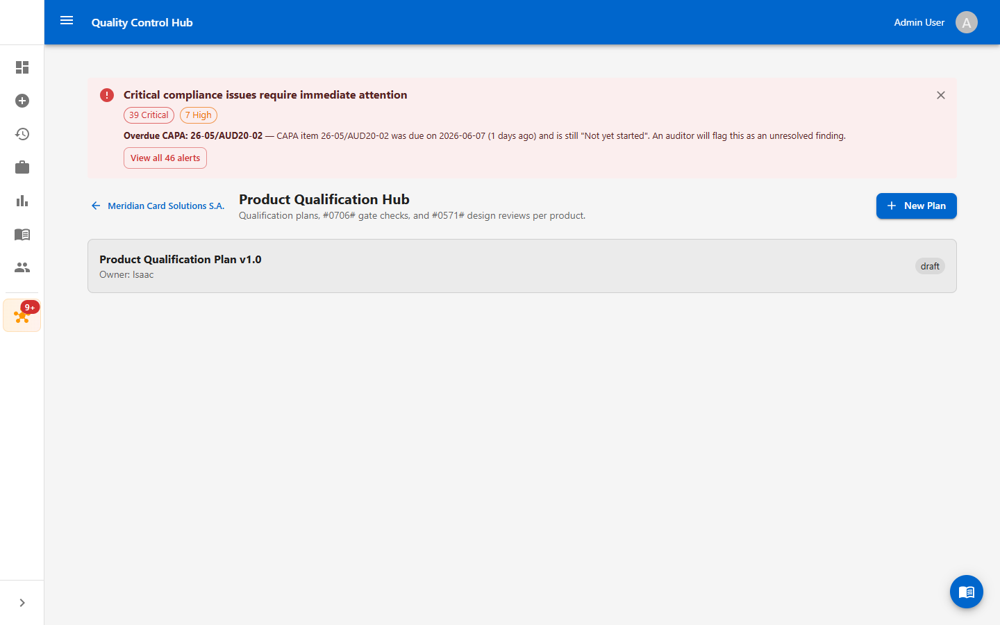
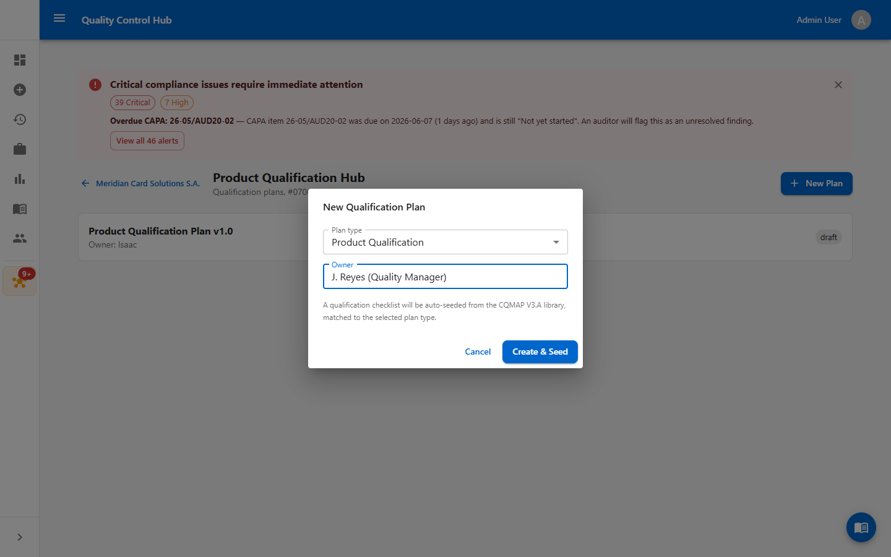
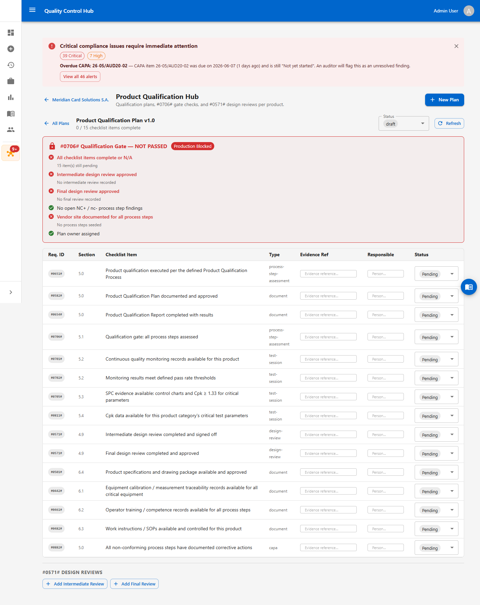
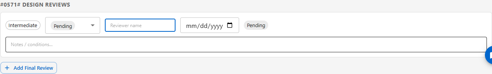
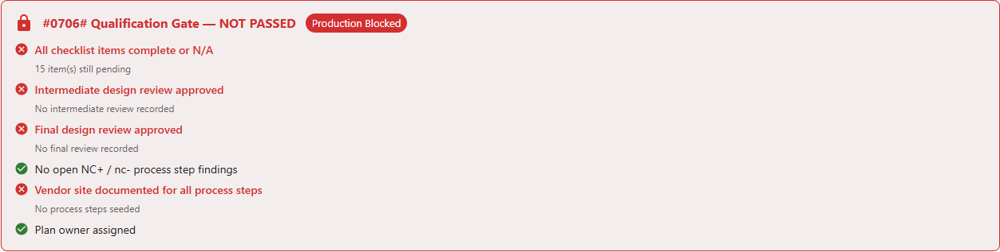

# Work Instruction — Performing a Qualification in NEXUS

**Document ID:** WI-NEXUS-QUAL-001
**System:** Quality Control Hub — NEXUS Qualification Hub
**Standard:** Mastercard CQMAP V3.A (CQM Requirements 3a, Nov 2025)
**Audience:** Quality Managers, Auditors, CQM Primary Contacts

---

## 1. Purpose

This work instruction explains how to create and complete a **Qualification** in the NEXUS Qualification Hub. A Qualification is the documented proof that a product design is sound (**Product Qualification**) and that the process producing it is capable and under control (**Process Qualification**), before any CQM product is released to production.

## 2. Scope

Applies to all CQM product categories (IC, ICM, IL, CB, ICC, P, IAC, BSM and their sub-activities) qualified against CQMAP V3.A. Each Qualification is attached to a NEXUS **audit record** for a vendor site.

## 3. Roles & responsibilities

| Role | Responsibility |
|---|---|
| Quality Manager | Owns the qualification plan; assigns responsibilities; drives the checklist to completion. |
| Process / Design Engineer | Provides evidence (SPC, Cpk, specs, calibration, training). |
| Reviewer | Signs off the intermediate and final design reviews (#0571#). |
| Auditor | Verifies the qualification gate (#0706#) before production release. |

## 4. The qualification process at a glance

```
Create Qualification Plan (#0582# / #0651#)
        │
        ├─► Work the checklist — attach evidence to each requirement
        │
        ├─► Intermediate Design Review (#0571#)        [checkpoint]
        │
        ├─► Process evidence — SPC (#0705#), Process Capability / Cpk (#0811#)
        │
        ├─► Final Design Review (#0571#)               [must be APPROVED]
        │
        ▼
#0706# QUALIFICATION GATE — all conditions green ──► production may proceed
```

---

## 5. Prerequisites

Before starting, confirm:

- You are signed in to the Quality Control Hub with a **Quality Manager**, **Auditor**, or **Admin** role (write access to NEXUS).
- A NEXUS **audit record** exists for the vendor site being qualified.
- The audit's **Product Scope** and **process steps** have been entered (the gate checks these).

---

## 6. Step-by-step procedure

### Step 1 — Open the NEXUS Hub and select the audit

From the left sidebar, open **NEXUS Hub**. The dashboard lists active audits. Click the audit (vendor site) you are qualifying — here, *Meridian Card Solutions S.A.*



### Step 2 — Open the Qualification Plans tab

On the audit record, open the **Qualification Plans** tab (also reachable via the *Qual. Plans* quick-navigate button).



### Step 3 — Review existing plans / start a new one

The **Product Qualification Hub** lists every plan for this audit with its owner and status. Click **New Plan** to create one.



### Step 4 — Create and seed the plan

In the dialog:

1. Choose the **Plan type** — *Product Qualification* or *Process Qualification*.
2. Enter the **Owner** (responsible Quality Manager).
3. Click **Create & Seed**.

A canonical checklist is auto-seeded from the CQMAP V3.A library, matched to the plan type (Product = 15 items, Process = 13 items).



### Step 5 — Work the qualification checklist

Open the plan to see its checklist, the live gate panel, and the design-review section. For each checklist row:

- Enter an **Evidence Ref** (document number, test session ID, CAPA reference, etc.).
- Assign a **Responsible** person.
- Set the **Status** — *Pending → In Progress → Complete*, or *N/A* if it does not apply.

The header shows live progress (e.g. *0 / 15 checklist items complete*). Each requirement ID (e.g. **#0651#**, **#0582#**, **#0654#**, **#0705#**, **#0811#**) maps to its CQMAP V3.A clause.



### Step 6 — Record the design reviews (#0571#)

In the **Design Reviews** section, click **Add Intermediate Review** and later **Add Final Review**. For each, record the **Reviewer**, **date**, **outcome** (*pending / approved / conditional / rejected*), and any notes or conditions.

> The gate requires the **intermediate** review to be *approved* or *conditional*, and the **final** review to be *approved*.



### Step 7 — Check the qualification gate (#0706#)

The gate panel evaluates in real time and shows **NOT PASSED / Production Blocked** until every condition is met. The six conditions are:

1. All checklist items complete or N/A
2. Intermediate design review approved
3. Final design review approved
4. No open NC+ / nc- process-step findings
5. Vendor site documented for all process steps
6. Plan owner assigned



### Step 8 — Promote the plan status

As work progresses, update the plan **Status** dropdown: *draft → in-progress → submitted → approved* (or *rejected*). Only promote to **approved** once the gate shows all conditions green.

---

## 7. Completion criteria

A Qualification is complete when:

- The gate panel shows **all six conditions passed** (no "Production Blocked" banner).
- Both design reviews are recorded, with the final review **approved**.
- The plan status is set to **approved**.

Only then may qualified product be produced using the qualified process (#0706#).

---

## 8. Reference

- `docs/qualification-process-flow-review.md` — process flow and the canonical requirement-ID mapping.
- `docs/cqmAP-3a-2025-11-30-VENDOR-COUNTRY-SITE.md` — the full CQMAP V3.A requirements catalog.

## 9. Revision history

| Version | Date | Author | Notes |
|---|---|---|---|
| 1.0 | 2026-06-09 | Quality Control Hub | Initial issue. Checklist aligned to canonical CQMAP V3.A requirement IDs. |
