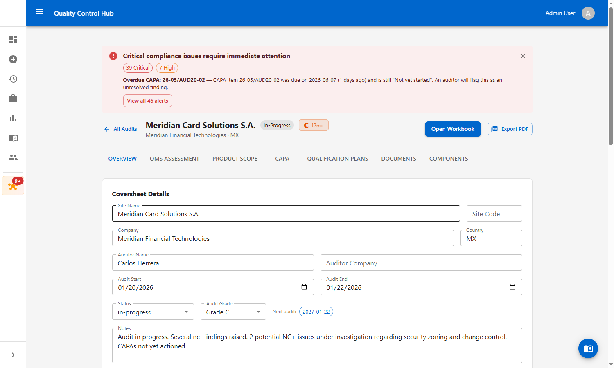
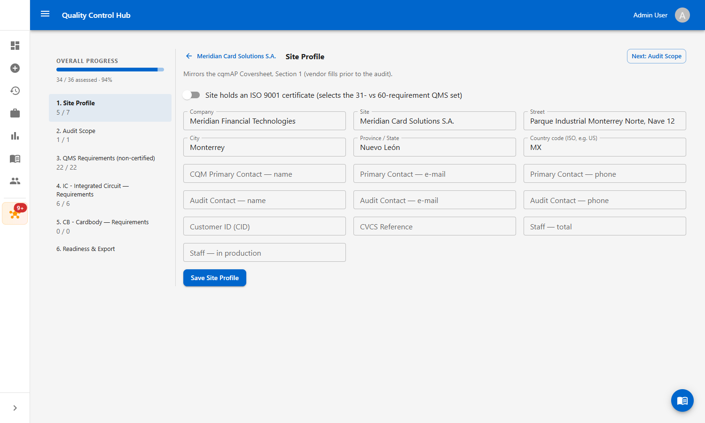
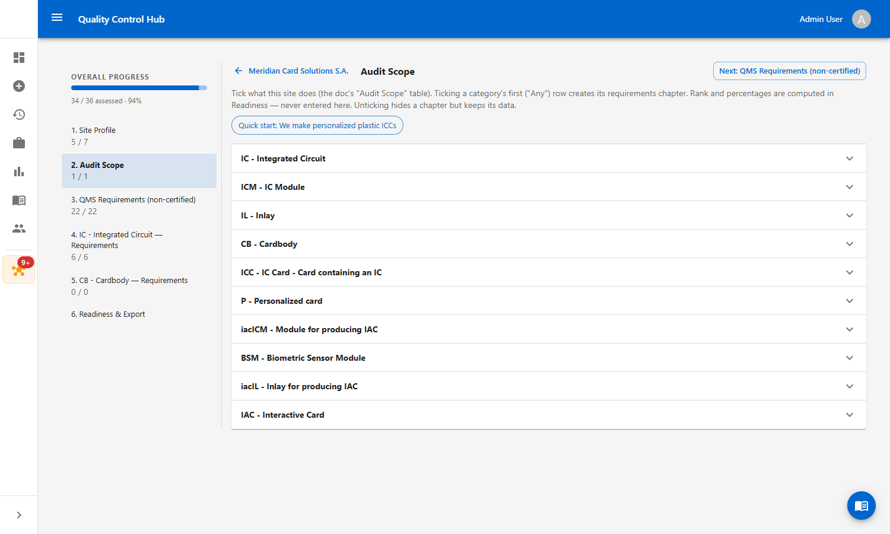
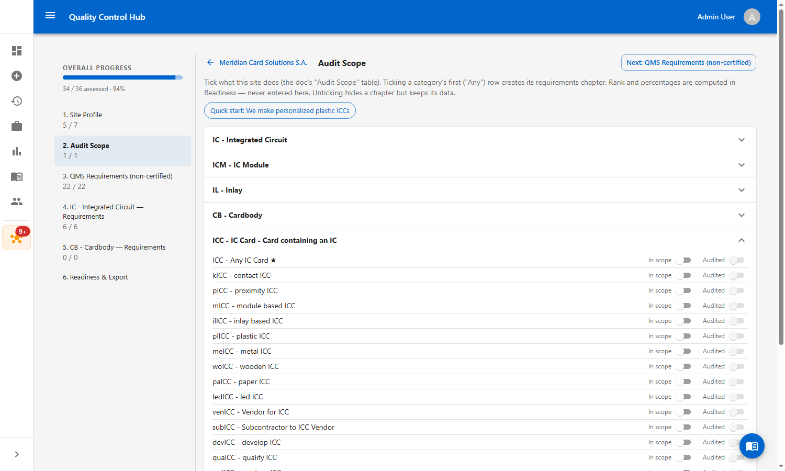
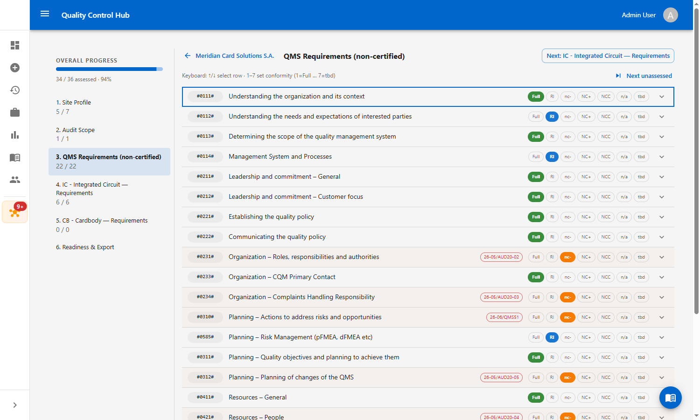
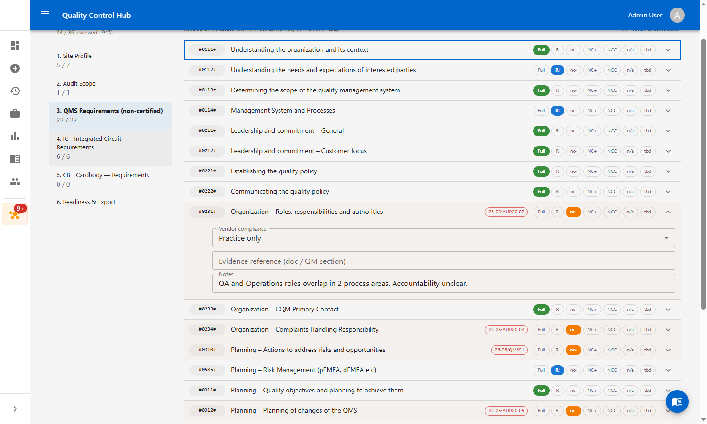
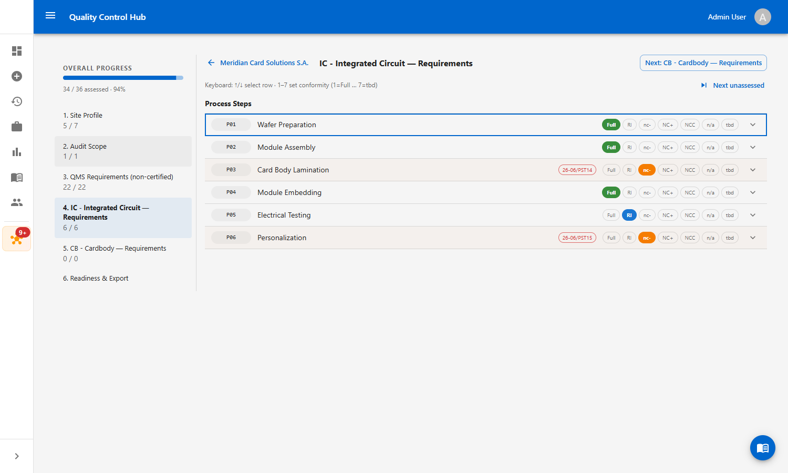
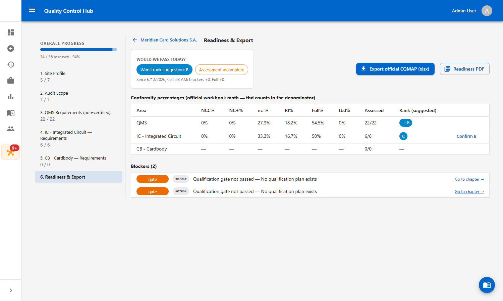
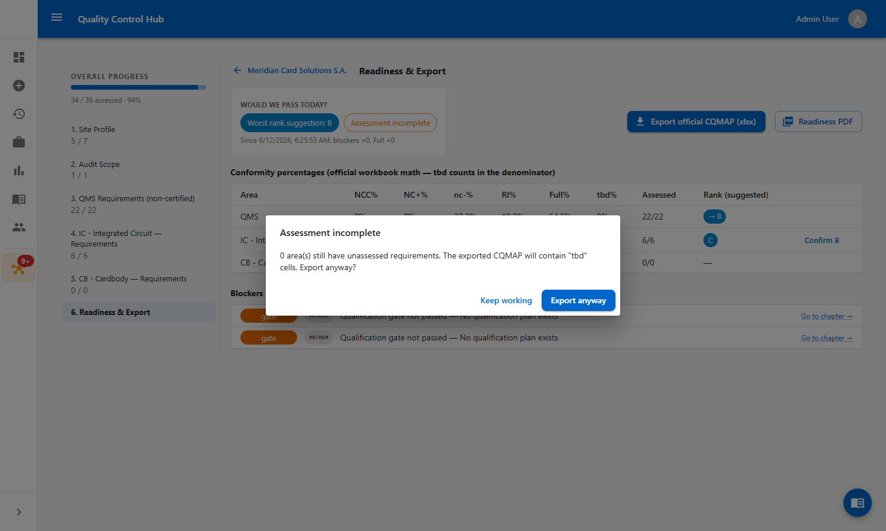

# Work Instruction — Completing the Assessment Workbook in NEXUS

**Document ID:** WI-NEXUS-WB-002
**System:** Quality Control Hub — NEXUS Assessment Workbook
**Standard:** Mastercard CQMAP V3.A (CQM Requirements 3a, Nov 2025)
**Audience:** Quality Managers, Auditors, CQM Primary Contacts

---

## 1. Purpose

This work instruction explains how to start and complete an **Assessment Workbook** — the guided, doc-faithful dry run of the Mastercard CQM audit. The workbook walks you through the same chapters as the official cqmAP V3.A document (site profile, audit scope, QMS requirements, per-product requirements), computes readiness using the official workbook's math, and exports your answers into the **official CQMAP xlsx** plus an internal **Readiness PDF**.

Use it to answer one question before the real auditor arrives: **"Would we pass today?"**

## 2. Scope

Applies to every NEXUS audit record. One workbook exists per audit; it reads and writes the same data as the classic QMS Assessment / Product Scope tabs, so work done in either place stays in sync.

## 3. Roles & responsibilities

| Role | Responsibility |
|---|---|
| CQM Primary Contact | Fills the Site Profile (cqmAP Coversheet data). |
| Quality Manager | Sets the Audit Scope; assesses QMS and process-step requirements; clears blockers. |
| Process / Design Engineer | Provides evidence references, specs, and equipment details per row. |
| Auditor (internal dry-run) | Reviews conformity grades, confirms ranks, and signs off the export. |

## 4. The workbook process at a glance

```
1. Site Profile  ──►  2. Audit Scope  ──►  3. QMS Requirements
                                                  │
                              4..N. One chapter per in-scope product category
                                                  │
                                                  ▼
                  N+1. READINESS — percentages, rank suggestions, blockers
                                                  │
                              fix blockers, re-check (trend shows your delta)
                                                  │
                                                  ▼
                  EXPORT — official CQMAP xlsx  +  internal Readiness PDF
```

## 5. Prerequisites

Before starting, confirm:

- You are signed in to the Quality Control Hub with an **Admin**, **Quality Manager**, or **Auditor** role (write access to NEXUS).
- A NEXUS **audit record** exists for the vendor site (NEXUS Hub → All Audits → New Audit if not).

## 6. Conformity values (used throughout)

Every requirement row is graded with one tap (or one keystroke) using the official cqmAP conformity scale:

| Value | Key | Meaning |
|---|---|---|
| **Full** | 1 | Fully conform |
| **RI** | 2 | Room for Improvement — conform, with observations |
| **nc-** | 3 | Minor non-conformity |
| **NC+** | 4 | Major non-conformity — *auto-creates a CAPA* |
| **NCC** | 5 | Critical non-conformity — *auto-creates a CAPA* |
| **n/a** | 6 | Not applicable (excluded from the percentages) |
| **tbd** | 7 | Not assessed yet (counts against you in the percentages) |

> Grading a row **NC+**, **nc-**, or **NCC** automatically creates a CAPA item in the audit's CAPA register. The row shows a red CAPA badge with the action ID — there is nothing extra to do; track it on the CAPA tab.

---

## 7. Step-by-step procedure

### Step 1 — Open the workbook

From **NEXUS Hub**, open the audit (vendor site) you are preparing. On the audit record header, click the primary **Open Workbook** button.



### Step 2 — Chapter 1: Site Profile

The workbook opens on **Site Profile**, which mirrors Section 1 of the cqmAP Coversheet. The left rail lists every chapter with its progress and an overall progress bar — you can jump between chapters at any time, or use the **Next:** button to move forward in document order.

1. Set the **ISO 9001 certificate** switch correctly — it selects which QMS requirement set applies to this site (certified = short set, non-certified = full set).
2. Fill the company, address, contact, identifier, and staff fields. These land 1-for-1 in the Coversheet cells of the exported CQMAP.
3. Click **Save Site Profile**.



### Step 3 — Chapter 2: Audit Scope

Tick what this site actually does — this is the doc's "Audit Scope" table. Each product category (IC, ICM, IL, CB, ICC, P, …) expands to its official variant list.



Rules of thumb:

- Ticking a category's first row (the **"Any …" row, marked ★**) puts the category in scope and **creates its requirements chapter** in the rail, pre-seeded with all of its process steps.
- Tick additional variant rows (e.g. *plICC - plastic ICC*) to describe the site precisely — they appear in the export's scope table but do not duplicate the requirements chapter.
- The **In scope** switch controls whether the row counts; the **Audited** switch records whether it was covered during the (dry-run) audit.
- Unticking a category hides its chapter but **keeps all entered data** — re-tick to get it back.
- The **Quick start** chip pre-ticks the typical card-vendor combination in one click.



### Step 4 — Chapter 3: QMS Requirements

Work the QMS requirement list top to bottom. Each row shows its cqmAP tag (e.g. `#0231#`), the requirement title, and the one-tap conformity chips.



Fastest way through the list — keyboard flow:

1. Click any row to focus it (blue outline).
2. **↑ / ↓** moves the focus; keys **1–7** set the conformity (1=Full … 7=tbd).
3. **Next unassessed** jumps straight to the next row still on *tbd*.

To record supporting detail, expand a row with the chevron:

- **Vendor compliance** — the official self-assessment dropdown (*Yes / Procedure only / Practice only / No / tbd / n/a*).
- **Evidence reference** — document number or QM section that proves it.
- **Notes** — free-text comments; they export into the official sheet.



### Step 5 — Chapters 4..N: Product category requirements

Each in-scope category gets its own chapter listing its process steps, grouped into the doc's sections (*Process Steps*, *Qualification & Design*, *Product Requirements*). Grade them exactly like QMS rows — same chips, same keyboard flow, same expandable detail fields (vendor site, process spec ref, control plan ref, production/test equipment, notes).

Extra markers you may see on a row:

- **Red CAPA badge** — a finding on this row auto-created a CAPA (click-through on the CAPA tab).
- **Flask icon** — physical test data exists for this requirement in Test Sessions (evidence you can point the auditor to).
- **Clipboard icon** (qualification rows) — opens the **Qualification Plan drawer** in place: see the #0706# gate state, tick checklist items, and review design reviews without leaving the workbook.



### Step 6 — Final chapter: Readiness & Export

This is the payoff screen. It answers **"Would we pass today?"** using the official workbook's math (tbd counts in the denominator; n/a is excluded):

- **Worst rank suggestion** — the severity ladder applied to your findings: any NCC → D, else NC+ → C, else nc- → B, else A. Rank is *suggested*, never auto-applied.
- **Conformity percentages table** — one row per area (QMS + each category), exactly the columns the auditor's sheet computes.
- **Confirm <rank>** — writes the suggested rank onto the scope row. The #0706# qualification gate is enforced: confirming A/B/C without a passing gate is rejected with the reason.
- **Blockers** — everything stopping a clean audit: NC+/NCC findings, unpassed #0706# gates, unassessed requirements. **Go to chapter →** jumps you straight to the offending chapter.
- **Trend line** — after your second visit, shows the delta since the previous readiness check (*blockers +/-, Full +/-*), so you can see the dry-run → fix → re-check loop working.



### Step 7 — Export

Two exports, side by side on the Readiness chapter:

1. **Export official CQMAP (xlsx)** — fills a pristine copy of the official `cqmAP-3a` template with everything you entered: Coversheet, Audit Scope & Compliance, the correct QMS sheet (certified vs non-certified), and each in-scope category sheet. Rows are matched by their official tags, so the file opens in Excel exactly like the auditor's own copy.
2. **Readiness PDF** — the internal one-page summary (verdict, percentage table, blocker list) for management review; it does not go to the auditor.

If the assessment is incomplete, the export warns you first — unassessed rows export as *tbd*:



Click **Export anyway** to download regardless, or **Keep working** and use the blockers list to finish.

---

## 8. Completion criteria

The dry run is complete when, on the Readiness chapter:

- the **Fully assessed** chip is green (no *tbd* anywhere),
- the **Blockers** list is empty (*"None — ready for the auditor"*),
- every category's rank is confirmed,
- and the exported CQMAP xlsx has been reviewed and filed.

## 9. Troubleshooting

| Symptom | Cause / fix |
|---|---|
| "Save failed — value reverted" toast | The server rejected the value (network or validation). Re-try; check the value against the row's dropdown options. |
| Confirm rank fails with a #0706# message | The category's qualification gate is not passing. Open the plan drawer (clipboard icon) or the Qualification Plans tab and complete the gate conditions. |
| Category chapter shows 0 / 0 rows | The scope row exists but no process steps were seeded (e.g. it was created as a variant row). Untick and re-tick the category's ★ "Any …" row, or add steps via the Product Scope tab. |
| A chapter disappeared from the rail | Its category was unticked in Audit Scope. Re-tick it — the data is preserved. |
| Keyboard keys don't grade rows | Click an empty part of a row first (focus must not be inside a text field), then use ↑/↓ and 1–7. |

## 10. Related documents

- **WI-NEXUS-QUAL-001** — Performing a Qualification in NEXUS (qualification plans, design reviews, the #0706# gate).
- `docs/cqmAP-3a-2025-11-30-VENDOR-COUNTRY-SITE.xlsx` — the official Mastercard CQMAP V3.A workbook this process mirrors.
